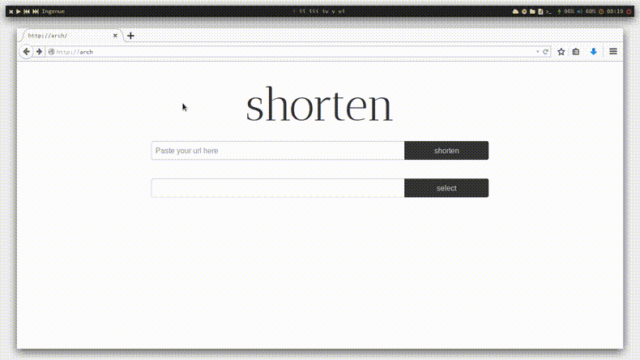

shorten
===

Shorten is an `io.js` URL shortener powered by `koa.js`. It uses in-memory database, though adding a proper database is straightforward.




Installation
---

You need to have `io.js >= 1.0.0` installed. See [iojs.org](https://iojs.org) for installation.

```shell
$ git clone https://github.com/juhohei/shorten.git
$ cd shorten
$ npm install
```


Usage 
---

Check out [index.js](index.js#L13-24) for id generation algorithms to use. Then:

```shell
$ npm start       # or
$ iojs index.js   # or
$ node index.js   # symlinked on io.js install
```

You can specify a port to run the server on (default 3000):

```shell
$ PORT=8080 iojs index.js
$ sudo PORT=80 iojs index.js
```

Then either navigate to `http://localhost:PORT` or use tools such as `curl` (see [api](#api)). Doesn't probably work wth Internet Explorer.


API
---

**POST /shorten**  
**Parameters**: link (the link to shorten), if there's no protocol http:// is assumed.  
**Returns**: id for the shortened link (text/plain)  
**curl example**: `curl -d 'link=example.com' localhost:3000/shorten`


**GET /:id**  
**Redirects**: to previously stored URL, also returns the link for parsing; 404's if there's no link with given id
**curl example**: `curl localhost:3000/id`

Use `-i` option with `curl` to see the headers.


License
---

MIT

